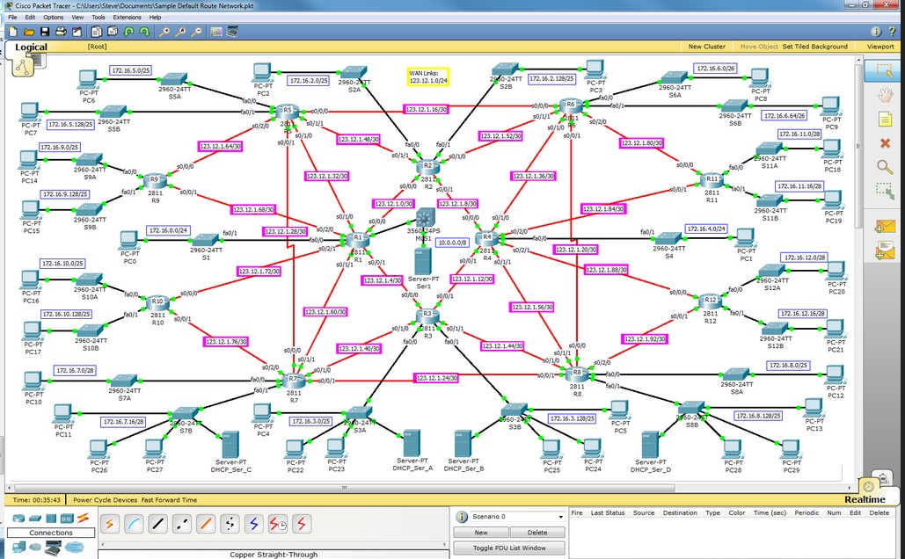
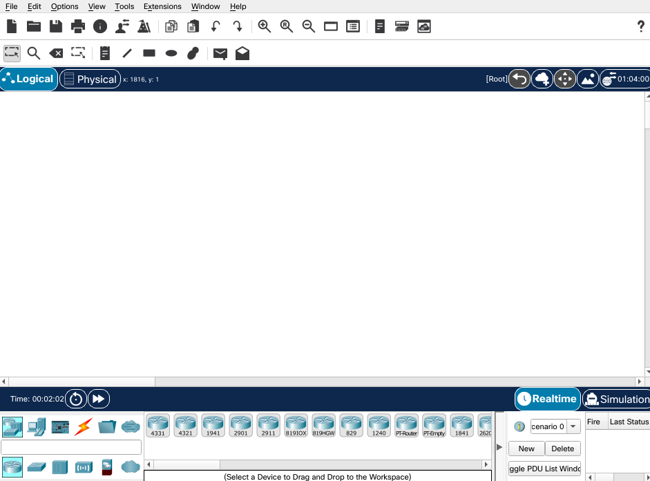

# Packet Tracer

Cisco Packet Tracer è un *simulatore di rete* professionale fornito gratuitamente da [Cisco System](https://www.cisco.com/).

Con Packet Tracer puoi fare pratica ed apprendere gli aspetti più importanti del networking. Puoi simulare reti di qualsiasi complessità avendo a disposizione la simulazione di apparati reali.

Puoi impatrare ad utilizzare le principali interfacce di configurazione degli apparati Cisco (standard di mercato nel campo delle telecomunicazioni ed Internet).


Usa Cisco Packet Tracert come ambiente di apprendimento e di sperimentazione.
Con Packet Tracer potrai:
- Creare reti virtuali di qualsiasi complessita
- Potrai capire a fondo il funzionamento di switch, router, access point e molti altri dispositivi di rete
- Visualizzare la configurazione della rete ed il flusso del traffico
- Simulare passo-passo la trasmissione di pacchetti sulla rete virtuale



Per un'introduzione dettagliata al tool segui questo corso gratuito:

https://www.netacad.com/courses/packet-tracer/introduction-packet-tracer


## Installazione 

1. Scaricare il packetto di installazione di [Cisco Packet Tracer](https://drive.google.com/drive/folders/1k2Dq2BdDphjFnVIV9zXAMGWAjLtN3v0i?usp=sharing)
2. Per Windows fare doppio click sull'eseguibile e seguire le istruzioni
3. Per Linux, installare eseguendo i seguenti comandi:

```
sudo apt update
sudo apt-get install libgl1-mesa-glx libxcb-xinerama0-dev
sudo dpkg -i CiscoPacketTracer_801_Ubuntu_64bit.deb
```

4. Accettare la licenza EULA e termini di utilizzo
5. Eseguire `packettracer` da linea di comando o dal menu
6. Una volta che l'applicazione è partita, effettuare il login con le seguenti credenziali Netwrok Academy
   1. username: *espedito.mancuso@istitutoagnelli.it* 
   2. password: *wie5Gai9Hei4chei*
7. Se tutto è andato a buon fine, dovresti vedere una schermata simile a questa 



Bene ora sei pronto ad utilizzare Cisco Packet Tracer!!!

```
PS: Se hai qualche problema con packetracer, eseguilo con il flag `--no-sandbox`, dovrebbe risolvere alcuni tipi di problemi
```

**Happy Networking!!**
